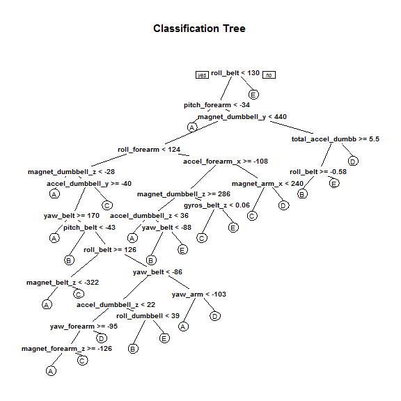

# Practical Machine Learning Course Project


Updated on 2015-04-24 by Sarah Huang

## Summary

A data set containing the data from accelerometers on the belt, forearm, arm, and dumbell of 6 participants is analyzed. The participants were asked to perform barbell lifts correctly and incorrectly in 5 different ways. The goal is to predict the manner in which they did the exercise. 

The data set has two parts, one for training and the other for testing. The factor variable "classe" is the response variable. We first took the training set to build the model and estimated the out-of-sample error using cross validation. We experimented with a few different algorithms including linear discriminant analysis, decision tree, boosting and random forest. The best performing model was then applied to the test set to obtain the predictions. 

The data for this project come from this source: http://groupware.les.inf.puc-rio.br/har (see the section on the Weight Lifting Exercise Dataset).

## Data Preparation

Load the necessary libraries and set the seed for reproducibility.


```r
library(caret); library(randomForest); library(rpart); library(rpart.plot); library(gbm)
set.seed(2688)
```

Load the data.


```r
if (!file.exists("training.csv")) {
  trainUrl <- "http://d396qusza40orc.cloudfront.net/predmachlearn/pml-training.csv"
  download.file(trainUrl, "training.csv", mode="wb")
}
if (!file.exists("testing.csv")) {
  testUrl <- "http://d396qusza40orc.cloudfront.net/predmachlearn/pml-testing.csv" 
  download.file(testUrl, "testing.csv", mode="wb")
}
train <- read.csv("training.csv", na.strings=c("", NA)) #read the data and replace blank values with NA
test <- read.csv("testing.csv", na.strings=c("", NA))    
```

Take a look at the training data.


```r
str(train, list.len=20) #data structure
```

```
## 'data.frame':	19622 obs. of  160 variables:
##  $ X                       : int  1 2 3 4 5 6 7 8 9 10 ...
##  $ user_name               : Factor w/ 6 levels "adelmo","carlitos",..: 2 2 2 2 2 2 2 2 2 2 ...
##  $ raw_timestamp_part_1    : int  1323084231 1323084231 1323084231 1323084232 1323084232 1323084232 1323084232 1323084232 1323084232 1323084232 ...
##  $ raw_timestamp_part_2    : int  788290 808298 820366 120339 196328 304277 368296 440390 484323 484434 ...
##  $ cvtd_timestamp          : Factor w/ 20 levels "02/12/2011 13:32",..: 9 9 9 9 9 9 9 9 9 9 ...
##  $ new_window              : Factor w/ 2 levels "no","yes": 1 1 1 1 1 1 1 1 1 1 ...
##  $ num_window              : int  11 11 11 12 12 12 12 12 12 12 ...
##  $ roll_belt               : num  1.41 1.41 1.42 1.48 1.48 1.45 1.42 1.42 1.43 1.45 ...
##  $ pitch_belt              : num  8.07 8.07 8.07 8.05 8.07 8.06 8.09 8.13 8.16 8.17 ...
##  $ yaw_belt                : num  -94.4 -94.4 -94.4 -94.4 -94.4 -94.4 -94.4 -94.4 -94.4 -94.4 ...
##  $ total_accel_belt        : int  3 3 3 3 3 3 3 3 3 3 ...
##  $ kurtosis_roll_belt      : Factor w/ 396 levels "-0.016850","-0.021024",..: NA NA NA NA NA NA NA NA NA NA ...
##  $ kurtosis_picth_belt     : Factor w/ 316 levels "-0.021887","-0.060755",..: NA NA NA NA NA NA NA NA NA NA ...
##  $ kurtosis_yaw_belt       : Factor w/ 1 level "#DIV/0!": NA NA NA NA NA NA NA NA NA NA ...
##  $ skewness_roll_belt      : Factor w/ 394 levels "-0.003095","-0.010002",..: NA NA NA NA NA NA NA NA NA NA ...
##  $ skewness_roll_belt.1    : Factor w/ 337 levels "-0.005928","-0.005960",..: NA NA NA NA NA NA NA NA NA NA ...
##  $ skewness_yaw_belt       : Factor w/ 1 level "#DIV/0!": NA NA NA NA NA NA NA NA NA NA ...
##  $ max_roll_belt           : num  NA NA NA NA NA NA NA NA NA NA ...
##  $ max_picth_belt          : int  NA NA NA NA NA NA NA NA NA NA ...
##  $ max_yaw_belt            : Factor w/ 67 levels "-0.1","-0.2",..: NA NA NA NA NA NA NA NA NA NA ...
##   [list output truncated]
```

The first 7 features are apparently irrelevant to the prediction thus we remove those. We also remove features with many missing values. This applys to both training data and test data. Further variable selection is unecessary for the algorithms we will experiment.


```r
train <- train[, c(-(1:7))]
train <- train[ , colSums(is.na(train)) == 0]
test <- test[, c(-(1:7))]
test <- test[ , colSums(is.na(test)) == 0]
dim(train)
```

```
## [1] 19622    53
```

## Machine Learning

To allow for cross validation, we split the training data set into 2 groups, 75% for building the model and 25% for validation. The validation data set will be used to calculate the expected out-of-sample error.


```r
inTrain <- createDataPartition(train$classe, p=.75, list=FALSE)
trainSub <- train[inTrain, ] #data to train the model
testSub <- train[-inTrain, ] #data for cross validation
```

We'll try 4 different modeling algorithms for our data set which has continuous predictors and a 5-level categorical response (multinomial classification)

First model: Linear Discriminant Analysis (LDA)


```r
ldaFit <- train(classe ~ ., method="lda", data=trainSub)
m1 <- confusionMatrix(testSub$classe, predict(ldaFit, testSub))
print(m1)
```

```
## Confusion Matrix and Statistics
## 
##           Reference
## Prediction    A    B    C    D    E
##          A 1149   18  119  103    6
##          B  156  600  115   42   36
##          C  107   70  548  100   30
##          D   46   42   97  586   33
##          E   29  162   67   98  545
## 
## Overall Statistics
##                                         
##                Accuracy : 0.699         
##                  95% CI : (0.686, 0.712)
##     No Information Rate : 0.303         
##     P-Value [Acc > NIR] : <2e-16        
##                                         
##                   Kappa : 0.619         
##  Mcnemar's Test P-Value : <2e-16        
## 
## Statistics by Class:
## 
##                      Class: A Class: B Class: C Class: D Class: E
## Sensitivity             0.773    0.673    0.579    0.631    0.838
## Specificity             0.928    0.913    0.922    0.945    0.916
## Pos Pred Value          0.824    0.632    0.641    0.729    0.605
## Neg Pred Value          0.904    0.926    0.902    0.916    0.974
## Prevalence              0.303    0.182    0.193    0.189    0.133
## Detection Rate          0.234    0.122    0.112    0.119    0.111
## Detection Prevalence    0.284    0.194    0.174    0.164    0.184
## Balanced Accuracy       0.850    0.793    0.751    0.788    0.877
```

Second model: Classification tree (CART)


```r
rpartFit <- rpart(classe ~ ., method="class", data=trainSub)
rpart.plot(rpartFit, main="Classification Tree", under=TRUE)
```

 

```r
m2 <- confusionMatrix(testSub$classe, predict(rpartFit, testSub, type="class"))
print(m2)
```

```
## Confusion Matrix and Statistics
## 
##           Reference
## Prediction    A    B    C    D    E
##          A 1299   30   32   21   13
##          B  215  479  188   56   11
##          C   21   45  731   56    2
##          D   92   15   78  526   93
##          E   19   47  111   74  650
## 
## Overall Statistics
##                                         
##                Accuracy : 0.751         
##                  95% CI : (0.739, 0.763)
##     No Information Rate : 0.336         
##     P-Value [Acc > NIR] : <2e-16        
##                                         
##                   Kappa : 0.684         
##  Mcnemar's Test P-Value : <2e-16        
## 
## Statistics by Class:
## 
##                      Class: A Class: B Class: C Class: D Class: E
## Sensitivity             0.789   0.7776    0.641    0.718    0.845
## Specificity             0.971   0.8904    0.967    0.933    0.939
## Pos Pred Value          0.931   0.5047    0.855    0.654    0.721
## Neg Pred Value          0.901   0.9654    0.899    0.950    0.970
## Prevalence              0.336   0.1256    0.232    0.149    0.157
## Detection Rate          0.265   0.0977    0.149    0.107    0.133
## Detection Prevalence    0.284   0.1935    0.174    0.164    0.184
## Balanced Accuracy       0.880   0.8340    0.804    0.825    0.892
```

Third model: Boosting


```r
gbmFit <- gbm(classe ~ ., data=trainSub, shrinkage=.1, n.trees=300, verbose=FALSE)
```

```
## Distribution not specified, assuming multinomial ...
```

```r
predictions <- predict(gbmFit, testSub, n.trees=300, type="response")
predictions <- as.factor(colnames(predictions)[apply(predictions, 1, which.max)])
m3 <- confusionMatrix(testSub$classe, predictions)
print(m3)
```

```
## Confusion Matrix and Statistics
## 
##           Reference
## Prediction    A    B    C    D    E
##          A 1328   20   15   18   14
##          B   91  782   53   15    8
##          C    3   45  779   19    9
##          D   13    6   60  712   13
##          E   10   22   25   35  809
## 
## Overall Statistics
##                                         
##                Accuracy : 0.899         
##                  95% CI : (0.891, 0.908)
##     No Information Rate : 0.295         
##     P-Value [Acc > NIR] : <2e-16        
##                                         
##                   Kappa : 0.872         
##  Mcnemar's Test P-Value : <2e-16        
## 
## Statistics by Class:
## 
##                      Class: A Class: B Class: C Class: D Class: E
## Sensitivity             0.919    0.894    0.836    0.891    0.948
## Specificity             0.981    0.959    0.981    0.978    0.977
## Pos Pred Value          0.952    0.824    0.911    0.886    0.898
## Neg Pred Value          0.967    0.976    0.962    0.979    0.989
## Prevalence              0.295    0.178    0.190    0.163    0.174
## Detection Rate          0.271    0.159    0.159    0.145    0.165
## Detection Prevalence    0.284    0.194    0.174    0.164    0.184
## Balanced Accuracy       0.950    0.926    0.908    0.934    0.963
```

Fourth model: Random Forest


```r
rfFit <- randomForest(classe ~ ., method="class", data=trainSub)
m4 <- confusionMatrix(testSub$classe, predict(rfFit, testSub, type="class"))
print(m4)
```

```
## Confusion Matrix and Statistics
## 
##           Reference
## Prediction    A    B    C    D    E
##          A 1395    0    0    0    0
##          B    4  944    1    0    0
##          C    0    2  852    1    0
##          D    0    0    4  799    1
##          E    0    0    0    5  896
## 
## Overall Statistics
##                                         
##                Accuracy : 0.996         
##                  95% CI : (0.994, 0.998)
##     No Information Rate : 0.285         
##     P-Value [Acc > NIR] : <2e-16        
##                                         
##                   Kappa : 0.995         
##  Mcnemar's Test P-Value : NA            
## 
## Statistics by Class:
## 
##                      Class: A Class: B Class: C Class: D Class: E
## Sensitivity             0.997    0.998    0.994    0.993    0.999
## Specificity             1.000    0.999    0.999    0.999    0.999
## Pos Pred Value          1.000    0.995    0.996    0.994    0.994
## Neg Pred Value          0.999    0.999    0.999    0.999    1.000
## Prevalence              0.285    0.193    0.175    0.164    0.183
## Detection Rate          0.284    0.192    0.174    0.163    0.183
## Detection Prevalence    0.284    0.194    0.174    0.164    0.184
## Balanced Accuracy       0.999    0.998    0.997    0.996    0.999
```

Comparison of results:

(out-of-sample error is calculated as (1 - accuracy))

Model | Out-of-sample error estimate | Summary
------ | ------ | ------
LDA | 0.301 | more assumptions, performs poorly when f() is complex. 
CART | 0.249 | low bias, high variance, easy to interpret, easily overfit, fast.
Boosting | 0.101 | reduced bias/variance, high accuracy
Random Forest | 0.004 | reduced bias/variance, high accuracy, poor interpretability, low speed. 

Random Forest performs the best. Since for this particular problem, we are not interested at all the relationships between the predictors and the response and our only concern is the accuracy, Random Forest wins.

## Predictions on the test set

Using Random Forest algorithm, we can reasonably expect the out-of-sample error in predicting the test set to be in line with what we obtained from cross validation as shown above.


```r
predict(rfFit, test, type="class")
```

```
##  1  2  3  4  5  6  7  8  9 10 11 12 13 14 15 16 17 18 19 20 
##  B  A  B  A  A  E  D  B  A  A  B  C  B  A  E  E  A  B  B  B 
## Levels: A B C D E
```


